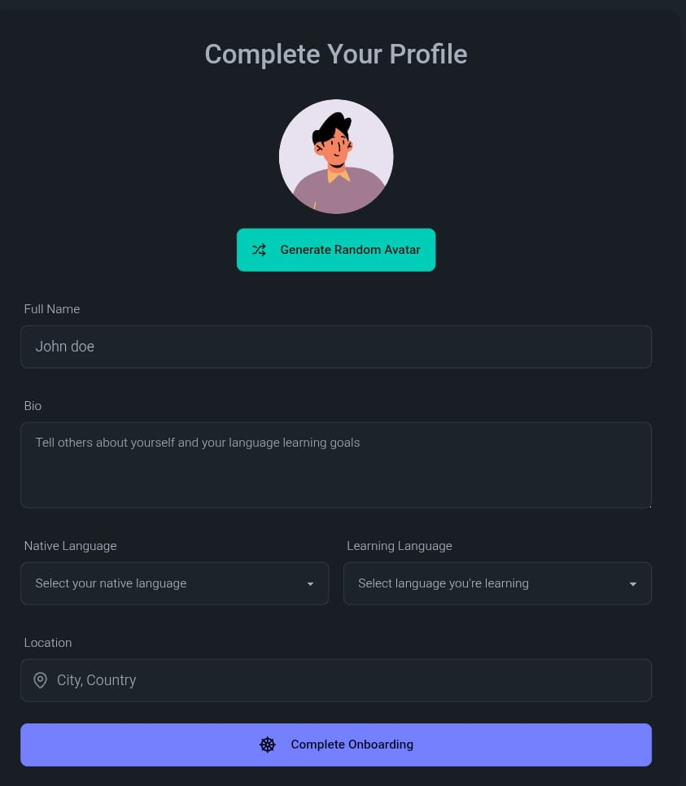

<h1 align="center">🌐 SyncSpace – Real-time Video Calling & Chat App for Language Exchange 🌐</h1>


<p align="center">
  <a href="https://syncspace-vywz.onrender.com/login" target="_blank"><strong>🚀 Live Demo</strong></a>
</p>

---

## ✨ Highlights

- 💬 **Real-time Chat** with typing indicators and message reactions  
- 🎥 **1-on-1 & Group Video Calls** with screen sharing and recording  
- 🌍 **Language Exchange Matching** to connect people globally  
- 🎨 **32 Unique UI Themes** to personalize your experience  
- 🔐 **Secure Authentication** using JWT & protected routes  
- 🧠 **Zustand-powered Global State Management**  
- 📦 **Scalable Tech Stack** – React, Express, MongoDB, TailwindCSS, TanStack Query  
- 🔄 **Stream API Integration** for chat and video streaming  

---

## 🌐 Live App

> 🔗 [Visit SyncSpace Now](https://syncspace-0a4n.onrender.com)


---

## 📸 Screenshots 

### 📝 Sign Up


### 🎥 Onboarding 
 

### 🔐 Login


### 🏠 Homepage


### 🔔 Notifications


### 💬 Chat Page


### 📞 Call Page


---

## 🧪 Environment Setup

### 📁 Backend (`/backend`)
Create a `.env` file inside the `/backend` directory:

```env
PORT=5001
MONGO_URI=your_mongo_uri
STEAM_API_KEY=your_steam_api_key
STEAM_API_SECRET=your_steam_api_secret
JWT_SECRET_KEY=your_jwt_secret
NODE_ENV=development
```
### 📁 Frontend (/frontend)

Create a `.env` file inside the `/frontend` directory:
VITE_STREAM_API_KEY=your_stream_api_key
```env
VITE_STREAM_API_KEY=your_stream_api_key
```

### 🔧 Getting Started
### 🚀 Run Backend
```bash
cd backend
npm install
npm run dev
```

### 💻 Run Frontend
```bash
cd frontend
npm install
npm run dev
```
### 📁 Tech Stack

📦 Frontend     → React, Vite, TailwindCSS

🛠️ Backend      → Node.js, Express, MongoDB

⚡ Realtime     → Stream API

🧠 State Mgmt   → Zustand

🔁 Data Fetch   → TanStack Query (React Query)

🔐 Auth         → JWT (JSON Web Tokens)

☁️ Deployment   → Render
